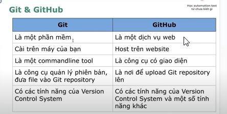

# Version control system (Hệ thống quản lý phiên bản)
1. Local: Lưu ở máy cá nhân
2. Centralize: Lưu ở 1 máy chủ tập trung
3. Distributed: Lưu ở nhiều máy khác nhau (git)
---------------------------------------

# GIT
1. Sự khác nhau giữa git và github : 

2. Các câu lệnh
   - **git init**: Khởi tạo kho lưu trữ mới  ở vùng working directory *(local -> working directory)*
   - **git add . (git add <filename>)**: Add all file (file được chỉ định) vào vùng stag *(working directory -> stag)*
   - **git commit -m "message"**: Tạo ra 1 phiên bản dựa vào các file được thêm ở vùng stag vào repo với thông điệp là "init project" *(stag -> repo)*

Note: <type>: <short_description>
   **chore**: sửa nhỏ lẻ, chính tả, xóa file không dùng tới,...
   **feat**: thêm tính năng mới, testcase mới
   **fix**: sửa lỗi 1 test trước đó

3. Workflow
   **Không dùng global config**: 
   init -> config -> add -> commit -> push

   **Dùng global config**: 
   init -> add -> commit -> push

Note: 
git config --global user.name "Xuan"
git config --global user.email "Xuanhihi@gmail.com"
-------------------------------------------------------
# JAVA

1. Biến
 **var <ten bien> = <gia tri>** : Khai báo biến
 **let <ten bien> = <gia tri>**
 **constant <ten bien> = value** : khai báo hằng số
Note: 
- var: cho phép khai báo lại 
        var a = 11;
        var a = 12; -> k lỗi
- let: không cho phép khai báo lại 
        let a = 11;
        let a = 12; -> Lỗi
- const: không cho phép gán lại
        constant a = 11;
        a = 12 ; -> lỗi
 
2. Kiểu dữ liệu
String, Number,Bigint, Boolean, Undefined, Null, Symbol, Object

3. Comparison operator = toán tử so sánh
- So sánh hơn kém: >, <
- So sánh bằng: ==, ===,!=, !==, >=, <=

4. Unary operator = toán tử một ngôi
- i++ bằng với i=i+1
- i-- bằng với i=i-1

5. Arithmetic operator = toán tử số học
- Các phép toán: +, -, *, /

6. Conditional = điều kiện, dùng để kiểm tra có nên thực hiện một đoạn logic không
- if (<điều kiện>) { // code }

7. Loops = vòng lặp
- for(<khởi tạo>; <điều kiện chạy>; <điều kiện tăng>) {
// code }

8. Format code
- Mac: Option + Shift + F
- Window: Alt + Shift + F

9. 